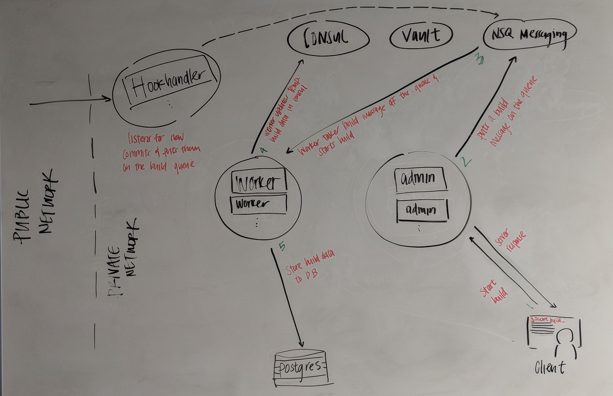

# Ocelot Architecture 
Ocelot is a distributed system with 5 components. Four of which are for the CI tool itself and one is the client used to interact and executions actions against the CI server. The four components of the CI tool are admin, worker, hookhandler, and poller. All 4 are stateless so new instances of any can be added to handle additional load. When a new build starts, a clean container with the specified base image in your ocelot.yml will be spawned and your build is then executed inside of that container. When the build is complete, the spawned container is then deleted and removed.    

## What Ocelot is made of

**Admin**: Admin is responsible for handling client requests and delegating to workers as needed.

**Worker**: Worker is responsible for processing builds 

**Hookhandler**: Hookhandler is responsible for receiving new commits and transforming them into builds for Worker to process [*this component is optional if you don't need commits to trigger new builds*] 

**Poller**: Poller is responsible for regularly checking to see if new commits exist for a project and if so, transform into a build for worker to process

## What Ocelot depends on 

**Consul**: This is where shared configurations between components are stored, where metadata associated with active builds are stored, and where worker publishes its publicly accessible IP and port (this is necessary because workers have access to special build related data such as build logs. Clients are redirected to stream logs from workers if the build is active).

**Vault**: This is where passwords, secrets, and ssh key files are stored

**NSQ**: NSQ is a lightweight messaging system facilitating communication between the distributed Ocelot components.

**Postgres**: This is where build data is stored 

## A simplified diagram of what happens when you run `ocelot build`

Interactions with Vault aren't shown above, but anytime credentials or secrets are needed during the build process, the spawned build container will retrieve them from Vault as needed. In addition, poller isn't shown but if polling is configured for a repository, new builds will also be added to NSQ when new commits are found.  

