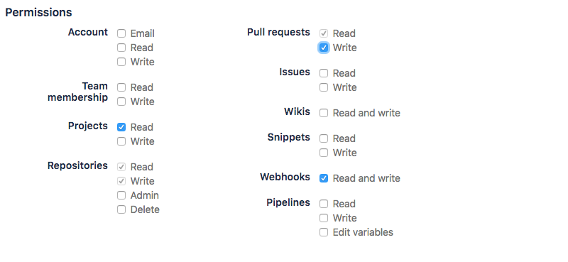

# Ocelot 
Ocelot is a distributed CI tool. 
It works using docker containers. or not.
If you build ios, see [non-docker builds](machinetagging.md). 

## Initial configuration
### VCS Credentials 
Ocelot integrates with Bitbucket using OAuth2. Therefore, to use it you must generate Bitbucket credentials in your account if you wish to build private repositories. The `level11consulting` user's credentials are already added. 

#### To add a new consumer for an account:  
- Sign in to account in Bitbucket   
- Go to Bitbucket Settings
- Click the `OAuth` tab in `Access Management`  
- Click the `Add consumer` button   
- Add a consumer with these permissions:  
     
- For callback url enter `https://hookhandler.metaverse.l11.com` and save  
- Take note of the client key and secret, you will need to upload those values to ocelot   

#### To add consumer credentials to Ocelot:  
You can either add them via stdin or via a file.   
**File Method**:   
Create a yaml file with your credentials. 
```yaml
vcs:
  - clientId: <client id from bitbucket consumer>
    clientSecret: <client secret from bitbucket consumer>
    tokenURL: https://bitbucket.org/site/oauth2/access_token
    acctName: <account name in bitbucket> 
    type: bitbucket
```
Run `ocelot creds vcs add -credfile-loc /path/to/yaml` 
You can also run `ocelot creds vcs add` from the command line and it will prompt you for these values. 

### Repo Credentials
**todo** add repo walkthrough here  
For credentials relating to items within your build, such as docker, gradle, or maven, you can upload using the `ocelot creds repo add` command  

## Notify Credentials 
You can upload creds for notifying on build status using `ocelot creds notify add`, documentation [here](notifications.md). For cli version > 0.3.0.

## `ocelot.yml`
Ocelot uses a file in the root of a git project to configure how to build, `ocelot.yml` 

Once you write the ocelot file, you can validate using `ocelot validate -file-loc=/path/to/ocelot.yml`

```yaml
image: jessishank/mavendocker
buildTool: maven
notify:
  slack:
    channel: "@jessishank"
    identifier: "ocelot-base"
    on:
      - "PASS"
      - "FAIL"
branches:
- master
env:
  - "MYENVVAR=1"
stages:
   - name: build
     env:
      - "BUILDENVVAR=2"
     script:
        - mvn clean install     
   - name: build2
     script:
        - docker build -t "docker.metaverse.l11.com/myrepo:v2_$GIT_HASH" .
        
   - name: docker push 
     script:
        - docker push "docker.metaverse.l11.com/myrepo:v2_$GIT_HASH"
        
   - name: echo_things
     script:
        - echo "$GIT_HASH"
        - echo "MYENVVAR"
   - name: deploy
     trigger:
       branches:
         - master
     script: 
        - echo "on branch master, deploying..."
        - kubectl set image deploy/mydeployment mydeployment=docker.metaverse.l11.com/mydeployment:latest
        - kubectl rollout status deploy/mydeployment
``` 

### `ocelot.yml` top level fields
|  key	| significance | required |
|--- |--- |--- |
| `image` | Image to run the build on. Can be a custom built image in a private repo or one on dockerhub.  |  If machineTag not present  |
| `machineTag` | **For builds that can't run in docker containers!** What type of werker node this build can run on, ie *ios*  see [here](machinetagging.md)|  If image not present  |
| `buildTool` | Flag that drives integration. If buildTool is maven, then a `settings.xml` will be generated with repository credentials  |  Yes |
| `notify` | Configuration for notifying on the status of builds  |  No |
| `branches` |  A list of branches to build. If the branch pushed does not match a value in this list, it wil not be built.  | Yes  |
| `env` |  List of environment variables that will be injected into the container on startup. The environment variables from this list will be available for all stages in the build.  |  No  |
| `stages` | List of stages that comprise the build and deployment. There must be on `build` stage, which is connected to the `buildTool` flag  | Yes  |

### `ocelot.yml` stage object fields  

|  key	| significance | required |
|--- |--- |--- |
| `name` |  Name of stage. Stages will be returned when running various `ocelot` commands for more detail on running builds.  |  Yes  |
| `script` |  List of commands to run that comprise that stage. If these commands return an exit code other than zero, it is recorded as failed. | Yes  |
| `env` |  List of environment variables to inject for current stage. |  No  | 
| `trigger`| Block that defines the conditions in which a stage will be run. Currently, a list of branches can be passed, and the stage will only execute if the build branch is in this list.| No |


### `ocelot.yml` slack notify object fields
|  key	| significance | required |
|--- |--- |--- |
| `identifier` |  The identifier you assigned to the notify cred when it was uploaded via `ocelot creds notify add` | Yes  |
| `channel` |  Which channel to post slack notification to. If this is blank, it will default to the channel that was chosen when the webhook was created  |  No  | 
| `on`| What statuses to send notification on, must be PASS or FAIL or both | Yes |

## Ocelot client interaction 
Interactions with ocelot are driven with the command line client. 

### Install client 

*todo: add name of admin server, not ip*

Add the following environment variables to your .bash_profile:  
```
export ADMIN_HOST=10.1.72.229
export ADMIN_PORT=31000
```

If your operating system is windows, the output from the client will be colorless. If you are a mac/linux user and wish to disable the colorized output, you can set the environment variable `NO_COLOR`

The ocelot client can be downloaded here: 

[**Mac**](https://s3-us-west-2.amazonaws.com/ocelotty/mac-ocelot.zip), [**Windows**](https://s3-us-west-2.amazonaws.com/ocelotty/windows-ocelot.zip), [**Linux**](https://s3-us-west-2.amazonaws.com/ocelotty/linux-ocelot.zip)

Then unzip, and move the ocelot binary to `/usr/local/bin`

#### homebrew

If you are on a mac and use `brew`, there is a tap for the ocelot client. 

```bash
 $ brew tap shankj3/ocelot
 ==> Tapping shankj3/ocelot
 Cloning into '/usr/local/Homebrew/Library/Taps/shankj3/homebrew-ocelot'...
 remote: Counting objects: 4, done.
 remote: Compressing objects: 100% (4/4), done.
 remote: Total 4 (delta 0), reused 2 (delta 0), pack-reused 0
 Unpacking objects: 100% (4/4), done.
 Tapped 1 formula (29 files, 68.8KB)
 $ brew install ocelot
 ==> Installing ocelot from shankj3/ocelot
 ==> Downloading https://s3-us-west-2.amazonaws.com/ocelotty/mac-ocelot-0.4.2.zip
 Already downloaded: /Users/jesseshank/Library/Caches/Homebrew/ocelot-0.4.2.zip
    /usr/local/Cellar/ocelot/0.4.2: 3 files, 26.2MB, built in 1 second
```

After the initial download, you can run update the ocelot client with `brew upgrade ocelot`


## Workflow
### Git Detection   
Ocelot utilizes git commands under the hood for detecting fields without having to insert a flag. If any of `-acct-repo`, `-hash`, `-acct` are required, you can forgo the flags when you are running the command from the repository directory you wish to be acting on.   
For example:   

```bash
15:09:06 jesseshank jessishank /Users/jesseshank 
$ ocelot status
You must either be in the repository you want to track, one of the following flags must be set: -acct-repo, -repo, -hash. see --help
15:09:08 jesseshank jessishank /Users/jesseshank 
$ cd code/test_ocelot/
15:10:05 jesseshank jessishank /Users/jesseshank/code/test_ocelot master
$ ocelot status
no -hash flag passed, using detected hash df754b7c4b04dba0cc37481a26313fc9be4db7b3

status: PASS 
hash: df754b7c4b04dba0cc37481a26313fc9be4db7b3
account: jessishank 
repo: mytestocy

[pre-build-validation] took 1 seconds to PASS
[setup] took 2 seconds to PASS
[build] took 11 seconds to PASS
[moretestystuff] took 9 seconds to PASS
```
 
 
### Tracking your repository   
When vcs credentials are first uploaded with `ocelot creds vcs add`, all repositories under that account are searched for the presence of the `ocelot.yml` file. If you wish to have ocelot track your 
repository after credentials have been added, you can run `ocelot watch -acct-repo <vcs_account>/<repo_name>`. You can also, from the directory of the project you wish tracked, run `ocelot watch`. 
Git commands will be run under the hood to detect the account and repository name. This will set up a webhook in VCS that will let ocelot know every time  

When webhooks are not a possibility, there is also an option to poll repositories for changes, by using `ocelot poll`.   
**To set up repo for polling**:   
```
11:18:00 jesseshank jessishank /Users/jesseshank/go/_/level11consulting/ocelot master
$ ocelot poll -acct-repo <vcs_account>/<repo_name> -branches <branch1>,<branch2>,<etc>,<etc> -cron "* * * * *"
```  

The cron string will be be validated before uploading to the server, then a service called poller will check for changes on that cron interval. To see a list of repos that are being tracked via polling and when they were last checked for changes, run:  

```
11:18:13 jesseshank jessishank /Users/jesseshank
$ ocelot poll list
   
   +-------------------------------------------+-------------+----------------+-------------------+
   |                 ACCT/REPO                 | CRON STRING |    BRANCHES    |    LAST POLLED    |
   +-------------------------------------------+-------------+----------------+-------------------+
   | level11consulting/gg-report               | */3 * * * * | master         | 04/20/18 11:18:03 |
   | level11consulting/ingress-service         | */3 * * * * | master         | 04/20/18 11:18:03 |
   | level11consulting/ui-gg                   | */3 * * * * | master         | 04/20/18 11:18:03 |
   | level11consulting/dx-account              | */3 * * * * | master         | 04/20/18 11:18:03 |
   | level11consulting/ad-admin-ui             | */3 * * * * | master         | 04/20/18 11:18:03 |
   | level11consulting/ad-tms                  | */3 * * * * | master         | 04/20/18 11:18:03 |
   | level11consulting/wayfinding-task-service | */3 * * * * | master         | 04/20/18 11:18:03 |
   | level11consulting/ocelot                  | */3 * * * * | master         | 04/20/18 11:18:04 |
   | level11consulting/ggmc-admin              | */3 * * * * | master         | 04/20/18 11:18:04 |
   | level11consulting/wayfinding-web          | */3 * * * * | master         | 04/20/18 11:18:04 |
   | level11consulting/ad-poc-service          | */3 * * * * | master,develop | 04/20/18 11:18:04 |
   +-------------------------------------------+-------------+----------------+-------------------+
```
 

### Triggering a build 
Builds are triggered by webhooks from bitbucket. Every time a changeset of commit(s) is pushed to the remote repository, a build will run. If you wish to trigger a build yourself, 
run `ocelot build -hash=<hash> -branch=<branch>`. The hash must be pushed to a vcs remote to be run. 

### Getting Status 
Once a build has begun, you can easily get its status. 

```
16:15:16 jesseshank jessishank /Users/jesseshank/go/_/level11consulting/ocelot re_queue_issue
$ ocelot status -hash 52

status: FAIL 
hash: 52a9eef26d247340371410583c713fd940e052e5
account: level11consulting 
repo: ocelot

[pre-build-validation] took 0 seconds to PASS
         * Passed initial validation ✓
[setup] took 29 seconds to PASS
         * pulled image golang:1.9 ✓
         * created build container ✓
         * downloading SSH key for level11consulting/ocelot...
         * successfully downloaded SSH key for level11consulting/ocelot  ✓
         * no integration data found for docker login so assuming integration not necessary
         * pulled image golang:1.9 ✓
         * created build container ✓
         * downloading SSH key for level11consulting/ocelot...
         * successfully downloaded SSH key for level11consulting/ocelot  ✓
         * completed setup stage ✓
[be_useful] took 0 seconds to PASS
         * completed be_useful stage ✓
[testing] took 59 minutes and 55 seconds to FAIL
         * failed to complete testing stage ✗: exit code was not 0

16:15:21 jesseshank jessishank /Users/jesseshank/go/_/level11consulting/ocelot re_queue_issue
$ 
```

#### Ocelot Status Flags and Precedence    
- `-hash`: Get status of a specific hash. This takes precedence over other arguments.
- `-acct-repo`: Get the latest status of a specific project delineated by <account name>/<repository>. Takes precedence over `-repo`.
- `-repo`: Returns the status of all repositories starting with this repo string.    


# Getting logs 
To get logs in your terminal, run `ocelot logs -hash=<hash>`. The hash flag allows for partial matching.   
For example: 

```bash
15:14:15 jesseshank jessishank /Users/jesseshank/code/test_ocelot master
$ ocelot logs
no -hash flag passed, using detected hash df754b7c4b04dba0cc37481a26313fc9be4db7b3
SETUP | Setting up...
SETUP | {"status":"Pulling from jessishank/mavendocker","id":"latest"}
SETUP | {"status":"Digest: sha256:7ef7e30732c103cde7520369433505c46f299bd9f79db5d4be73da580b526701"}
SETUP | {"status":"Status: Image is up to date for jessishank/mavendocker:latest"}
SETUP | Creating container...
SETUP | Container created with ID 3dce6470ada195b915f66ae2ca74daa98ffbc5f970a08d4eb4d0fb3db1014a3d
SETUP | Container 3dce6470ada195b915f66ae2ca74daa98ffbc5f970a08d4eb4d0fb3db1014a3d started
SETUP | --2018-03-19 19:54:56--  http://docker.for.mac.localhost:9090/do_things.tar
SETUP | Resolving docker.for.mac.localhost (docker.for.mac.localhost)... 192.168.65.2
SETUP | Connecting to docker.for.mac.localhost (docker.for.mac.localhost)|192.168.65.2|:9090... connected.
SETUP | HTTP request sent, awaiting response... 301 Moved Permanently
SETUP | Location: https://s3-us-west-2.amazonaws.com/ocelotty/werker_files.tar [following]
SETUP | --2018-03-19 19:54:56--  https://s3-us-west-2.amazonaws.com/ocelotty/werker_files.tar
SETUP | Resolving s3-us-west-2.amazonaws.com (s3-us-west-2.amazonaws.com)... 52.218.209.88
SETUP | Connecting to s3-us-west-2.amazonaws.com (s3-us-west-2.amazonaws.com)|52.218.209.88|:443... connected.
...
...
...
Downloaded from central: https://repo.maven.apache.org/maven2/org/codehaus/plexus/plexus-digest/1.0/plexus-digest-1.0.jar (12 kB at 847 kB/s)
Downloaded from central: https://repo.maven.apache.org/maven2/org/codehaus/plexus/plexus-utils/3.0.5/plexus-utils-3.0.5.jar (230 kB at 8.2 MB/s)
BUILD | [INFO] Installing /df754b7c4b04dba0cc37481a26313fc9be4db7b3/target/exampleboot-0.0.1-SNAPSHOT.jar to /root/.m2/repository/com/trident/example/boot/exampleboot/0.0.1-SNAPSHOT/exampleboot-0.0.1-SNAPSHOT.jar
BUILD | [INFO] Installing /df754b7c4b04dba0cc37481a26313fc9be4db7b3/pom.xml to /root/.m2/repository/com/trident/example/boot/exampleboot/0.0.1-SNAPSHOT/exampleboot-0.0.1-SNAPSHOT.pom
BUILD | [INFO] ------------------------------------------------------------------------
BUILD | [INFO] BUILD SUCCESS
BUILD | [INFO] ------------------------------------------------------------------------
BUILD | [INFO] Total time: 9.719 s
BUILD | [INFO] Finished at: 2018-03-19T19:55:09Z
BUILD | [INFO] Final Memory: 25M/186M
BUILD | [INFO] ------------------------------------------------------------------------
CLEANUP | Performing build cleanup...
15:14:16 jesseshank jessishank /Users/jesseshank/code/test_ocelot master
```

### Getting a summary
`ocelot summary -acct-repo <account name>/<repo name>`  
You can also set the `-limit` flag to reduce or expand the number of results shown. The default limit is 5. 
 
```bash
$ ocelot summary -limit 1
Flag -acct-repo was not set, detecting account and repository using git commands
Detected: jessishank/mytestocy

+----------+-----------+----------------+---------------------+--------+--------+------------------------------------------+
| BUILD ID |   REPO    | BUILD DURATION |     START TIME      | RESULT | BRANCH |                   HASH                   |
+----------+-----------+----------------+---------------------+--------+--------+------------------------------------------+
| 52       | mytestocy | 12 seconds     | Mon Mar 19 12:54:20 | PASS   | master | df754b7c4b04dba0cc37481a26313fc9be4db7b3 |
+----------+-----------+----------------+---------------------+--------+--------+------------------------------------------+
```
